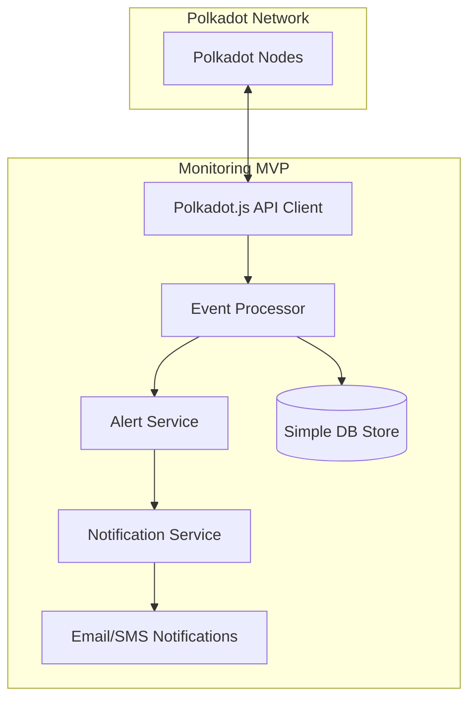
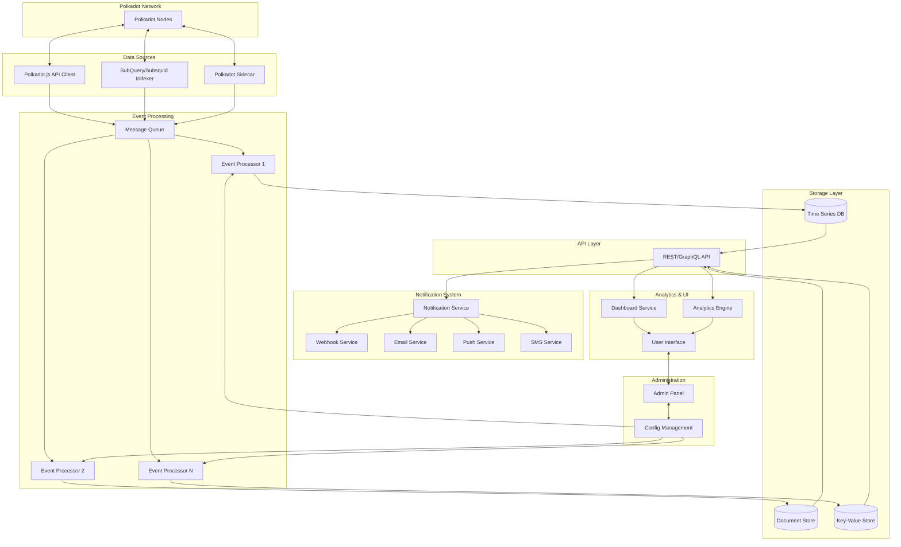

## MVP Architecture

```mermaid
flowchart TD
    subgraph "Polkadot Network"
        P[Polkadot Nodes]
    end

    subgraph "Monitoring MVP"
        A[Polkadot.js API Client] --> B[Event Processor]
        B --> C[Alert Service]
        B --> D[(Simple DB Store)]
        C --> E[Notification Service]
        E --> F[Email/SMS Notifications]
    end

    P <--> A
```

## Future Scalable Architecture

```mermaid
flowchart TD
    subgraph "Polkadot Network"
        P[Polkadot Nodes]
    end

    subgraph "Data Sources"
        A[Polkadot.js API Client]
        I[SubQuery/Subsquid Indexer]
        S[Polkadot Sidecar]
    end

    subgraph "Event Processing"
        MQ[Message Queue]
        EP1[Event Processor 1]
        EP2[Event Processor 2]
        EP3[Event Processor N]
    end

    subgraph "Storage Layer"
        TS[(Time Series DB)]
        DS[(Document Store)]
        KV[(Key-Value Store)]
    end

    subgraph "API Layer"
        API[REST/GraphQL API]
    end

    subgraph "Notification System"
        NS[Notification Service]
        WH[Webhook Service]
        EM[Email Service]
        PP[Push Service]
        SM[SMS Service]
    end

    subgraph "Analytics & UI"
        AN[Analytics Engine]
        DS1[Dashboard Service]
        UI[User Interface]
    end

    subgraph "Administration"
        AM[Admin Panel]
        CM[Config Management]
    end

    P <--> A
    P <--> I
    P <--> S
    
    A --> MQ
    I --> MQ
    S --> MQ
    
    MQ --> EP1
    MQ --> EP2
    MQ --> EP3
    
    EP1 --> TS
    EP2 --> DS
    EP3 --> KV
    
    TS --> API
    DS --> API
    KV --> API
    
    API --> NS
    API --> AN
    API --> DS1
    
    NS --> WH
    NS --> EM
    NS --> PP
    NS --> SM
    
    DS1 --> UI
    AN --> UI
    
    UI <--> AM
    AM <--> CM
    CM --> EP1
    CM --> EP2
    CM --> EP3
```