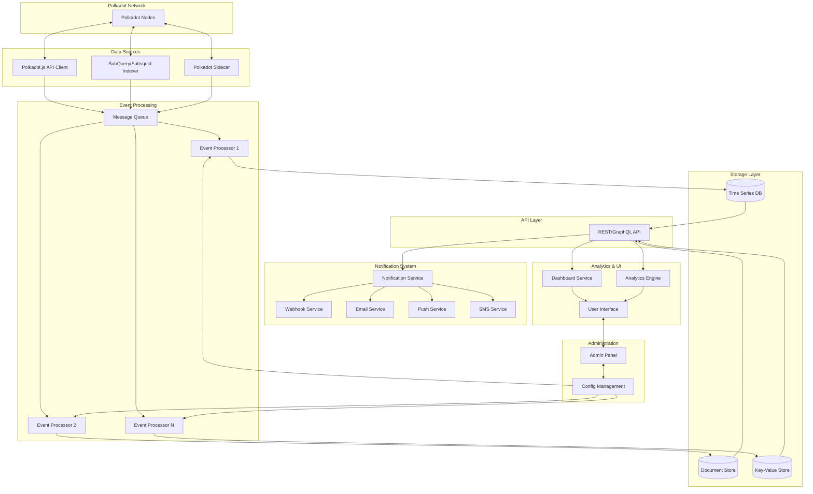

# 🧠 Senior Software Engineer Challenge

## 🧩 Challenge Overview

**Objective:**  
Design a simple, real-time monitoring solution for the **Polkadot blockchain**, with **future scalability** in mind.

The goal is to develop an MVP (Minimum Viable Product) of a monitoring system that can:
- Observe Polkadot blockchain activities in real-time
- Trigger alerts and send notifications
- Be adaptable and extensible in the future

We also encourage the inclusion of **high-level architectural diagrams** to demonstrate the system's possible evolution.

---

## 📦 Expected Deliverables

1. ✅ A **working software prototype** that runs out-of-the-box.
2. 🗺️ **Architecture diagrams** illustrating:
   - The current MVP
   - A future, scalable version of the system

---

## ⚙️ Functional Requirements

- Develop a **basic real-time monitoring** tool for the **Polkadot blockchain** using **TypeScript**
- Detect and respond to specific blockchain events (of your choice)
- Send **notifications** when those events occur

---

## 📈 Non-Functional Requirements

- The system should be:
  - **Lightweight**
  - **Efficient**
  - **Cloud-agnostic**
- The architecture must be designed with **scalability** in mind:
  - Should support **analytics** and **non-real-time monitoring**
  - Can evolve into a **single app** or a **multi-service system**
- You're free to use existing tools and frameworks to streamline development
- **Optional:** Provide a Kubernetes deployment setup using a **basic Helm chart**

---

## 🧭 Suggested Approach

If you're unsure where to start, consider the following suggestions:

### 🔍 Choose Blockchain Events to Monitor (examples):
- A **validator** getting **slashed**
- A **balance transfer** between accounts

### 🔌 Explore Useful Data Sources / Tooling:
- [Polkadot.js API](https://polkadot.js.org/) or **PAPI** for programmatic access
- Direct chain access using:
  - **JSON-RPC protocol**
  - **smoldot**
- Blockchain indexers like:
  - **SubQuery**
  - **Subsquid**
- **Polkadot Sidecar** — a REST service exposing blockchain data

---

## 🖼️ Architecture Diagrams

You should include:
- 📍 **Current MVP Diagram**
- 🌐 **Future Scalable System Diagram** (e.g., includes analytics, dashboards, modular microservices, etc.)

---

## ⏱️ Timeline & Communication

- ⏳ You have **one week** to complete the challenge
- 🗣️ Feel free to ask any questions at any time during the process

%%% MVP Architecture
flowchart TD
    subgraph "Polkadot Network"
        P[Polkadot Nodes]
    end

    subgraph "Monitoring MVP"
        A[Polkadot.js API Client] --> B[Event Processor]
        B --> C[Alert Service]
        B --> D[(Simple DB Store)]
        C --> E[Notification Service]
        E --> F[Email/SMS Notifications]
    end

    P <--> A

%%% Future Scalable Architecture
