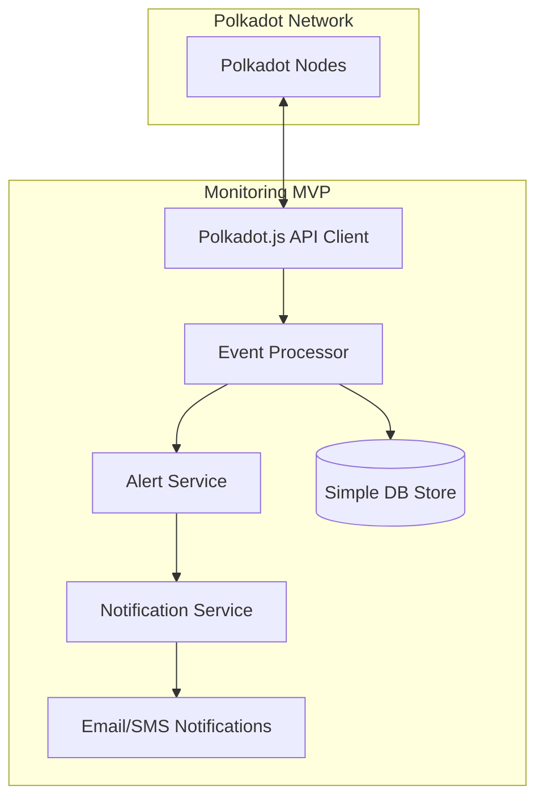

# MVP Architecture Overview

## Introduction
The MVP architecture for our Polkadot blockchain monitoring system is designed to be lightweight, efficient, and easy to deploy while still providing valuable real-time monitoring capabilities. The system is structured as a modular application with clear separation of concerns, allowing for future scalability.

## Architecture Diagram

## Core Components

### [Polkadot Nodes](./polkadot-nodes.md)
The actual blockchain network that provides data through RPC and WebSocket endpoints. Our system connects to these nodes to retrieve real-time events and state information.

### [Polkadot.js API Client](./polkadotjs-api-client.md)
The interface between our monitoring system and the blockchain. It handles connections to nodes, subscriptions to blockchain events, and data normalization.

### [Event Processor](./event-processor.md)
The core processing engine that analyzes blockchain events, applies monitoring rules, and determines when alerts should be triggered based on configured conditions.

### [Simple DB Store](./simple-db-store.md)
Provides persistent storage for blockchain events, alert history, and configuration. For the MVP, this is a straightforward database implementation focused on reliability.

### [Alert Service](./alert-service.md)
Manages alert generation, classification, and routing based on events identified by the Event Processor. It determines severity and appropriate notification channels.

### [Notification Service](./notification-service.md)
Handles the delivery of alerts to various notification channels, ensuring reliable delivery with retry mechanisms and delivery tracking.

### [Email/SMS Notifications](./email-sms-notifications.md)
The actual delivery channels for notifications, providing specific implementations for email and SMS delivery through third-party service providers.

## Data Flow

1. The **Polkadot.js API Client** connects to **Polkadot Nodes** and subscribes to relevant blockchain events
2. When events occur, they are received by the client and forwarded to the **Event Processor**
3. The **Event Processor** analyzes the events, applying monitoring rules to detect conditions of interest
4. Relevant events are stored in the **Simple DB Store** for historical reference
5. When alert conditions are met, the **Event Processor** triggers the **Alert Service**
6. The **Alert Service** classifies and formats the alert, then forwards it to the **Notification Service**
7. The **Notification Service** delivers the alert through the appropriate **Email/SMS Notification** channels

## Technical Stack

- **Language**: TypeScript/JavaScript
- **Runtime**: Node.js
- **Database**: SQLite (MVP), with option to upgrade to PostgreSQL
- **Blockchain Interface**: Polkadot.js API
- **Notification Delivery**: Email service (SendGrid/SES) and SMS gateway (Twilio)
- **Configuration**: YAML/JSON files for initial MVP

## Deployment Model

For the MVP, the system is designed to run as a single application with all components deployed together, simplifying operations and reducing infrastructure requirements. The system can be deployed:

- On a single server or VM
- As a Docker container
- On serverless platforms with persistent storage

## Monitoring Focus Areas

The MVP will focus on monitoring several key aspects of the Polkadot blockchain:

1. **Validator Operations**: Slashing events, offline reports, changes in active set
2. **Balance Transfers**: Large value movements, specific account activity
3. **Governance**: Proposals, referenda, and council activities
4. **Network Health**: Finality delays, block production issues
5. **Custom Conditions**: User-defined monitoring rules for specific scenarios

## Scalability Considerations

While designed as a streamlined MVP, the architecture includes several features that facilitate future scaling:

- Component separation to allow independent scaling
- Database abstraction for migration to more robust solutions
- Modular event processing pipeline for distributed processing
- Clear interfaces between components to support microservice evolution

## Limitations

The MVP architecture has some intentional limitations to facilitate quick development:

- Single instance deployment model (no clustering)
- Limited historical data retention
- Basic alerting rules without complex correlation
- Fixed set of notification channels
- Manual configuration without a management UI

These limitations are addressed in the future scalable architecture. 